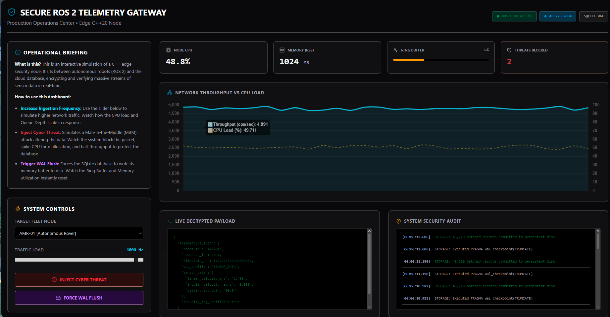

<h1 align="center">🛡️ Secure ROS 2 Telemetry Gateway</h1>

<p align="center">
  <b>A Zero-Trust, High-Throughput Edge Security Node for Autonomous Robotic Fleets</b><br>
  <sub>Created & Engineered by <b>Taha Udaipurwala</b></sub>
</p>

<p align="center">
  <a href="https://en.cppreference.com/w/cpp/20" target="_blank">
    
  </a>
  <a href="https://docs.ros.org/en/jazzy/" target="_blank">
    
  </a>
  <a href="https://www.openssl.org/" target="_blank">
    
  </a>
  <a href="https://react.dev/" target="_blank">
    
  </a>
</p>

<p align="center">
  A high-performance, edge-deployed security node designed for autonomous robotic fleets (AMRs, AGVs, UAVs). This gateway sits between ROS 2 hardware nodes and cloud storage, cryptographically verifying, decrypting, buffering, and persisting high-frequency telemetry data with sub-millisecond latency.
</p>

<hr />

## 🌐 Interactive Architectural Simulator

Because edge security gateways operate as headless backend daemons, I built a **React + Vite production-grade dashboard** to simulate the C++ node's internal state. This allows engineers and recruiters to interact with the system architecture directly in the browser.

<p align="center">
  👉 <a href="https://helloAi0.github.io/Secure-ROS2-Gateway/" target="_blank"><strong>Launch Live Telemetry Command Center</strong></a>
</p>

<div align="center">
  
</div>

<hr />

## 📖 Table of Contents
- [The Problem it Solves](#-the-problem-it-solves)
- [System Architecture](#-system-architecture)
- [Core Engineering Decisions](#-core-engineering-decisions)
- [Threat Modeling & Mitigation](#-threat-modeling--mitigation)
- [Local Build & Deployment](#-local-build--deployment)
- [Author](#-author)

<hr />

## 🎯 The Problem it Solves

In modern industrial robotics, transmitting raw ROS 2 sensor telemetry directly to centralized databases exposes fleets to Man-in-the-Middle (MitM) attacks and data corruption. Furthermore, standard database I/O cannot handle the high-frequency burst rates of hardware sensors, leading to packet loss and thread blocking. 

**This Gateway solves this by providing:**
1. **Zero-Trust Ingestion:** All DDS packets are forced through an AES-256-GCM verification pipeline.
2. **I/O Decoupling:** Hardware ingestion threads are completely isolated from disk writing threads using a lock-free Ring Buffer.

<hr />

## ⚙️ System Architecture

The data pipeline is designed for strict concurrency and memory safety, ensuring the system never drops a packet even under maximum load.

| Stage | Component | Function |
| :--- | :--- | :--- |
| **1. Ingestion** | **ROS 2 FastDDS** | Subscribes to high-frequency sensor topics with `SENSOR_DATA` QoS profiles for minimal latency. |
| **2. Verification** | **OpenSSL (AES-256-GCM)** | Authenticates the HMAC tag and decrypts the payload. Drops malicious/tampered packets instantly. |
| **3. Buffering** | **MPMC Queue** | A Multi-Producer, Multi-Consumer memory ring buffer that absorbs traffic spikes without blocking the network threads. |
| **4. Persistence** | **SQLite (WAL Mode)** | Batches data from the queue and commits it to persistent disk asynchronously using Write-Ahead Logging. |

<hr />

## 🧠 Core Engineering Decisions

### Why C++20?
Utilizes modern memory management (smart pointers), `std::atomic` for thread synchronization without mutex bottlenecks, and `std::span` for zero-copy buffer views during cryptographic operations.

### Why AES-256-GCM?
Galois/Counter Mode (GCM) provides both confidentiality (encryption) and authenticity (HMAC verification) in a single, hardware-accelerated pass. This is crucial for edge devices with limited compute overhead.

### Why SQLite WAL Mode?
Standard SQLite locks the entire database during writes. Write-Ahead Logging (WAL) allows concurrent readers and writers, preventing the edge database from becoming a bottleneck during high-throughput metric flushing.

<hr />

## 🚨 Threat Modeling & Mitigation

The simulator demonstrates the gateway's response to network anomalies:

*   **Man-in-the-Middle (MitM) Attack:** If a malicious node intercepts and alters telemetry data, the AES-GCM tag mismatch instantly flags the payload. The gateway drops the packet, isolates the threat, and preserves database integrity.
*   **DDoS / Traffic Spikes:** If ingestion frequency exceeds disk write speeds, the MPMC Ring Buffer absorbs the impact, scaling up CPU/Memory usage dynamically rather than crashing the ROS 2 node.

<hr />

## 🚀 Local Build & Deployment

### 1. Build the C++ ROS 2 Node (Backend)
Ensure you have ROS 2 Jazzy and OpenSSL installed.
```bash
# Navigate to your workspace
cd ~/ros2_ws

# Build the gateway package
colcon build --packages-select secure_telemetry_gateway

# Source the workspace and run the node
source install/setup.bash
ros2 run secure_telemetry_gateway gateway_node
```

<hr />

<br />

<div align="center">
  <table style="border: none; border-collapse: collapse;">
    <tr>
      <td align="center" style="border: none; padding: 20px;">
        
        <br /><br />
        <h2 style="margin: 0; font-size: 1.8em;">👤 System Architect & Engineer</h2>
        <h3 style="margin: 5px 0 15px 0; color: #58a6ff; font-weight: 500;">Taha Udaipurwala</h3>
        <p style="max-width: 500px; color: #8b949e; font-size: 0.95em; line-height: 1.5;">
          Specializing in zero-trust edge computing, high-performance robotics telemetry pipelines, and memory-safe concurrent C++ architectures.
        </p>
        <br />
        <a href="https://github.com/helloAi0" target="_blank">
          
        </a>
        &nbsp;&nbsp;
        <a href="https://github.com/helloAi0/Secure-ROS2-Gateway" target="_blank">
          
        </a>
      </td>
    </tr>
  </table>
</div>

<br />

<hr />
